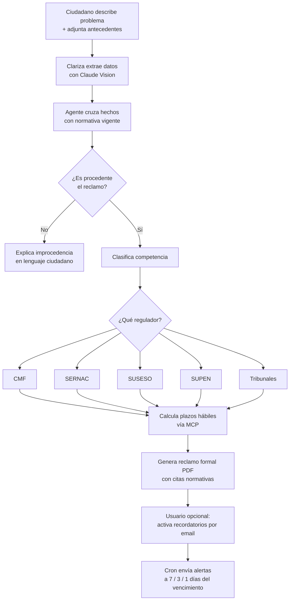
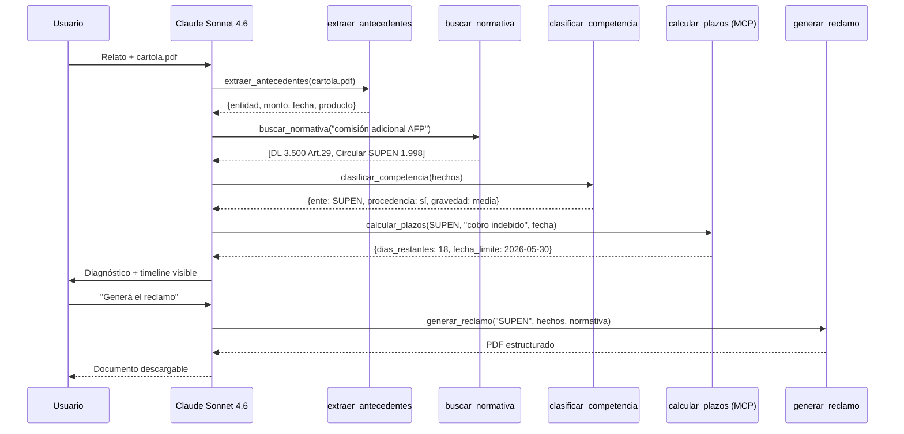
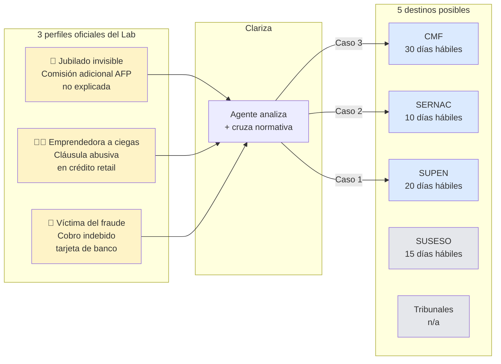
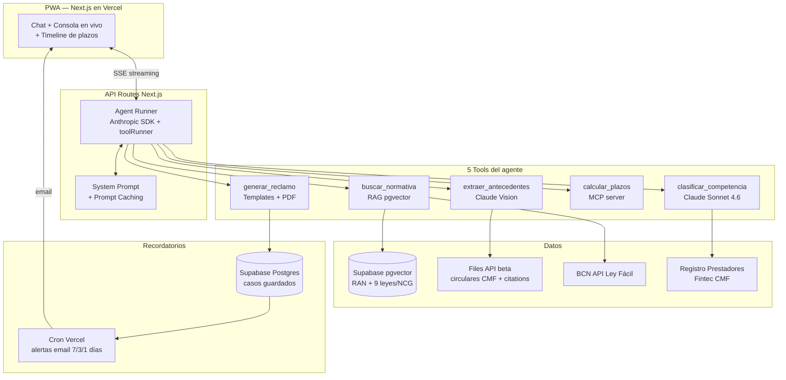

# Clariza — Diagramas

Diagramas de referencia de los flujos clave del producto. Renderizados con Mermaid (visibles directo en GitHub).

> Para el contexto completo ver [SPEC.md](SPEC.md).

---

## 1. Flujo principal end-to-end

Camino completo del ciudadano desde que describe su problema hasta que recibe recordatorios de plazos.

---

## 2. Agent loop con tools (lo que se ve en la consola)

Esto es lo que el jurado verá durante la demo — la consola lateral muestra cada llamada a tool y su resultado en vivo. Cumple sub-check **B3** de la rúbrica (≥3 mensajes visibles) y demuestra arquitectura agéntica (M3, 25%).

---

## 3. Casos demo → regulador competente

Los 3 casos curados para la demo mapean a 3 de los 4 perfiles oficiales del Impact Lab y demuestran que **el agente cambia de regulador según el caso**.

> Los plazos por regulador son ilustrativos para el diagrama. Los reales los entrega `calcular_plazos` desde la normativa vigente.

---

## 4. Arquitectura del sistema

---

*Diagramas vivos — se ajustan con el SPEC tras feedback del mentor.*
